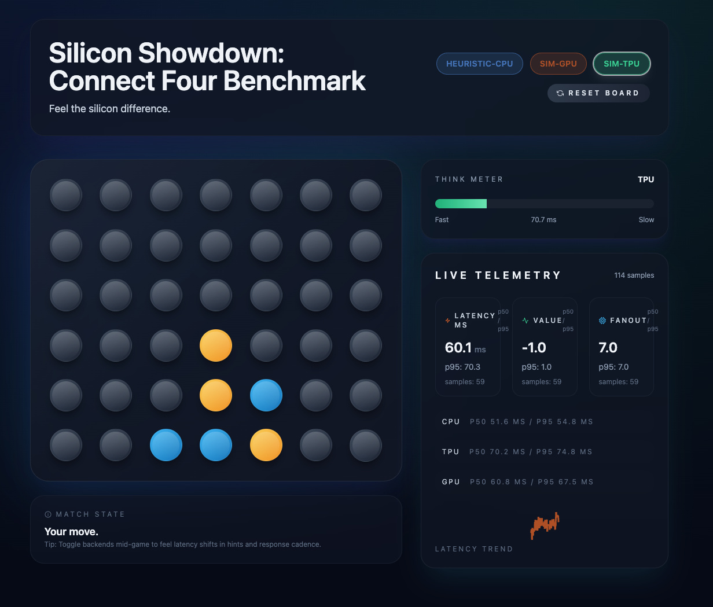

# Silicon Showdown: Connect Four Benchmark

Feel the silicon difference. This project pairs a cinematic Connect Four experience with fully-instrumented inference paths so players can sense how CPU, GPU, and TPU backends respond in real time.



## Why This Exists
- **Explain hardware choices through play.** The Think Meter, hint shimmer, and telemetry HUD expose latency and cadence differences you can feel immediately.
- **Offer an honest, portable benchmark.** Simulated backends keep the loop deterministic today, while the adapters are ready for real ONNX/JAX/TFLite models as soon as weights land.
- **Ship production-quality telemetry.** Every move is logged to newline-delimited JSON, the load generator exports CSVs, and Plotly dashboards turn runs into presentation-ready charts.

## Architecture in Brief
**Frontend — Vite + React + Tailwind**
- Animated Connect Four board (`GameBoard`) with backend-aware styling.
- Think Meter, latency sparkline, and telemetry cards fed by React Query + websocket stream.
- Hint shimmer requests suggestions on demand (disabled in test mode for clean suites).

**Backend — FastAPI**
- Unified `PolicyValueModel` interface with heuristic CPU, simulated GPU, and simulated TPU adapters.
- `/infer` endpoint validates boards, records latency, and pushes telemetry broadcasts.
- Sliding window metrics store writes to `bench/logs/telemetry.ndjson` and serves percentile summaries.

**Benchmarking Toolkit**
- `python -m bench.loadgen` runs asynchronous self-play across concurrent games and reports p50/p95 latency.
- `python -m bench.publish_report` combines telemetry and loadgen CSVs into Plotly HTML dashboards.
- Dockerfiles (CPU/GPU) plus Terraform stub lay the groundwork for real hardware deployments.

## Up & Running
1. **Backend**  
   ```bash
   cd apps/server
   python -m venv .venv
   source .venv/bin/activate
   pip install -r requirements.txt
   uvicorn app.api:app --reload --host 127.0.0.1 --port 8000
   ```
2. **Frontend**  
   ```bash
   cd apps/web
   npm install
   npm run dev
   ```
3. Open http://localhost:3000, drop a disc, and toggle CPU/GPU/TPU to watch the Think Meter and telemetry panel react. Telemetry logs accumulate under `bench/logs/`.

## Testing & Quality Gates
- Backend: `cd apps/server && source .venv/bin/activate && pytest`
- Frontend: `cd apps/web && npm run test -- --run`
- Pre-PR checklist: `npm run lint`, `ruff check apps/server`, and attach loadgen snippets when latency moves by >5%.

## Benchmarking Workflows
```bash
source apps/server/.venv/bin/activate
python -m bench.loadgen --backend gpu --games 50 --concurrency 6
python -m bench.publish_report --telemetry bench/logs/telemetry.ndjson --loadgen bench/logs/loadgen-*.csv
```
Generated CSVs and HTML live in `bench/logs/` (git-ignored). Populate `bench/cases/` with reproducible board states as you add regression tests.

## Documentation & Further Reading
- Contributor guide: [AGENTS.md](AGENTS.md)
- Project plan & roadmap: [PLAN.md](PLAN.md)
- Benchmarking toolkit details: [bench/README.md](bench/README.md)
- Model drop-off checklist: [models/README.md](models/README.md)
- TPU deployment stub: [deploy/terraform/README.md](deploy/terraform/README.md)

## Contributing
We welcome improvements across UI polish, real model integrations, telemetry sources, and deployment recipes. Follow the commit convention `<area>: <imperative>`, keep PRs focused, and include screenshots or benchmark deltas when behavior shifts.

## License
Code is MIT. Add your own licensing for weights or proprietary assets before distribution.
